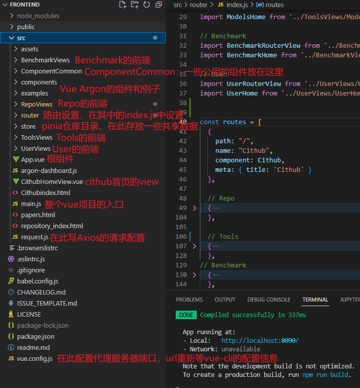
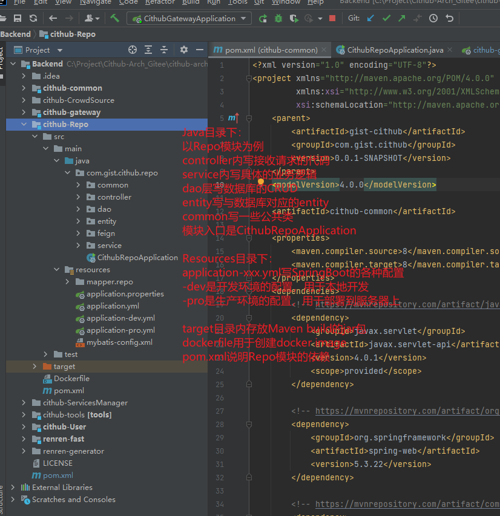

# Dependencies+运行办法

## 数据库

1. 首先安装Mysql 8.0.28
2. 然后创建数据库`cithub-repo`，并设置自己的root密码。
3. 导入sql文件`cithub-repo.sql`

## 后端

1. 首先需要安装JDK8
   下载地址：https://www.oracle.com/java/technologies/downloads/#java8-windows

2. 配置Java环境变量
   参考：https://zhuanlan.zhihu.com/p/153500777

3. 安装Maven 3.8.1
   参考：https://blog.csdn.net/affluent6/article/details/118404802

4. 右键Backend文件夹，选择open folder as idea project

5. 设置 Maven自动下载所需依赖
   参考：https://blog.csdn.net/fittec/article/details/118942425
   如遇Maven下载太慢或下载失败，考虑添加Maven仓库镜像。
   如自动下载依赖失败，手动点击Maven图标，然后reload project。
   

6. 所有依赖下载完成后，到application-dev.yml处更改自己的mysql username，password和url。

7. 安装Nacos 2.1.1
   下载地址：https://github.com/alibaba/[nacos](https://so.csdn.net/so/search?q=nacos&spm=1001.2101.3001.7020)/releases

8. 安装完毕后，cd 到 nacos安装目录的bin目录下

9. 打开cmd，输入`startup.cmd -m standalone`

10. 看到cmd输出`INFO Nacos started successfully in stand alone mode. use embedded storage`即表示nacos启动成功

11. 在idea运行每个模块的src/main/java/CithubXXXXApplication，点击函数名左边的绿色箭头即可运行。

    注意：不要忘记启动Gateway模块

12. idea在控制台输出`Started CithubXXXXXApplication in XXX seconds `即表示该模块启动成功。


后端依赖查看：

进入`Backend`目录的pom.xml，然后按住ctrl键点击cithub-common，即可查看所有依赖。


## 前端

确保后端正确运行再运行前端。

1. 首先需要安装Node.js v18.19.0版本
   下载地址：https://nodejs.cn/download/
   选择长期支持版本，然后安装

2. 安装完毕后，cd 到 Cithub_New\cithub\Frontend 目录下

3. 输入 npm i ，等待安装完毕
   如安装太慢，考虑设置新的npm源

4. 安装完毕后，输入 npm run serve，等待build完成。

5. build完成后在浏览器地址栏访问  http://localhost:8090/  即可启动项目

   前端依赖如下，也可在package.json文件的`dependencies` key 下查看

```
vue-argon-dashboard-2@3.0.0 C:\Project\Cithub_New\cithub\Frontend
├── @formkit/auto-animate@0.8.1
├── @popperjs/core@2.11.8
├── @vue/cli-plugin-babel@4.5.0
├── @vue/cli-plugin-eslint@4.5.0
├── @vue/cli-plugin-router@4.5.0
├── @vue/cli-service@4.5.0
├── @vue/compiler-sfc@3.2.0
├── @vue/eslint-config-prettier@6.0.0
├── axios@1.6.5
├── babel-eslint@10.1.0
├── bindings@1.5.0 extraneous
├── bootstrap@5.3.2
├── core-js@3.35.1
├── dropzone@6.0.0-beta.2
├── echarts@4.9.0
├── element-plus@2.5.2
├── eslint-plugin-prettier@3.3.1
├── eslint-plugin-vue@7.0.0
├── eslint@6.7.2
├── file-uri-to-path@1.0.0 extraneous
├── nan@2.18.0 extraneous
├── pinia@2.1.7
├── prettier@2.2.1
├── quill@1.3.7
├── sass-loader@10.1.1
├── sass@1.43.3
├── vue-flatpickr-component@11.0.3
├── vue-router@4.2.5
├── vue@3.4.15
└── vuex@4.1.0
```

# 前端项目结构



其中，Vue Argon的文档参见[Overview | Vue Argon Dashboard @ Creative Tim (creative-tim.com)](https://www.creative-tim.com/learning-lab/vue/overview/argon-dashboard/)


# 后端项目结构



# other notes

other notes文件夹内：

1. `本地开发汇总.md `是我在本地开发时做的一些笔记，可参考。
2. `部署问题汇总.md`和`服务器nginx+域名访问部署问题.MD`是我在部署时做的一些笔记，可参考。
