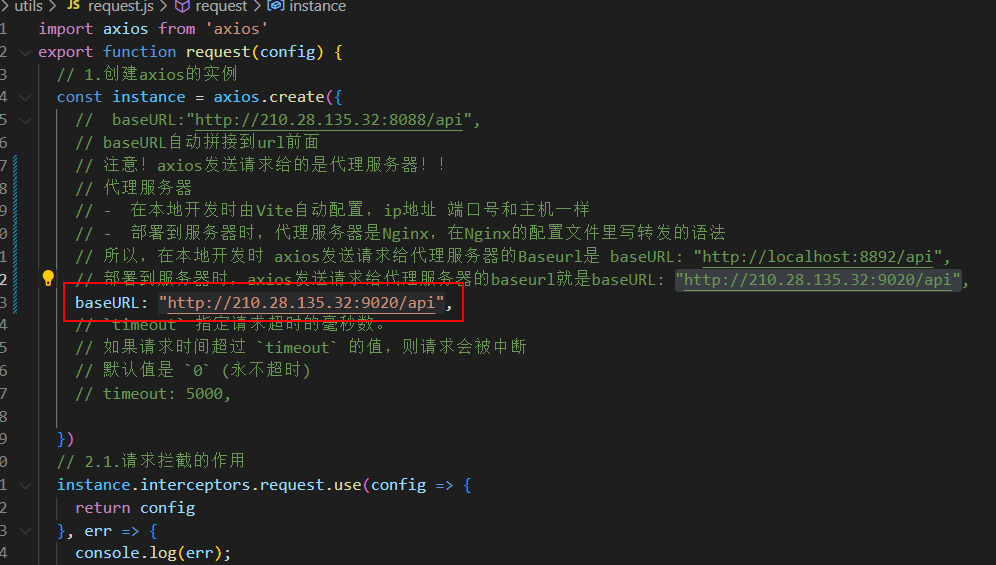
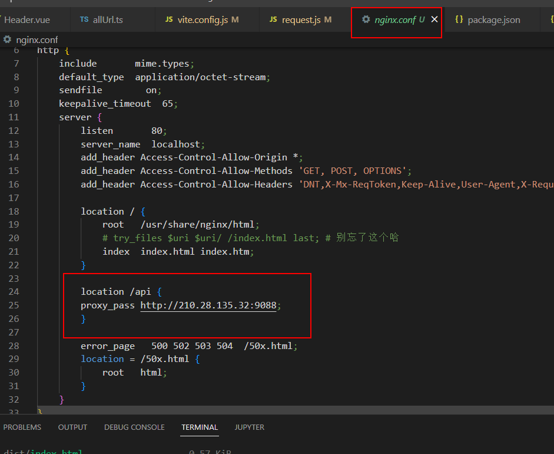

# 后端部署

## nacos相关

下载nacos的linux安装包

将安装包传到服务器上

切换到nacos安装包的bin目录

sh startup.sh -m standalone

至此nacos运行

## gateway相关

需要改的地方：

1. yml文件里server-addr改成nacos的地址

   其他不用改

## user/repo相关

需要改的地方：

1. yml文件里server-addr改成服务器nacos的地址
2. 数据库url改成服务器的地址

## 汇总

1. 至此后端要改的地方都改完了，打开maven，在总的gist-cithub上 选packge打包完成即可。

2. Dockerfile文件在对应目录内，看一下

   然后docker build -t 名字 .

# 前端部署

注意： 代理服务有两种：

本地开发：vite代理服务器，与浏览器同ip同端口，在vite proxy里改转发语法

部署到服务器：nginx代理服务器，ip是服务器ip，端口是docker 容器对外暴露的ip，改转发语法在nginx.conf里改

## userVue

只需要改axios request的baseurl，改成自己的nginx代理服务器的ip+容器对外暴露端口

然后打包 npm run build

打包完毕之后

docker build -t 名字 .

## repoVue

需要改的地方：

1. 改axios request的baseurl，改成自己的nginx代理服务器的ip+容器对外暴露端口
2. allUrl.ts里，改一下跳转的url

然后打包 npm run build

打包完毕之后

docker build -t 名字 .

## Nginx部署的问题汇总

### 我使用Vue和Vite进行本地开发，当我在本地开发Vue项目时，Vite会自动生成一个代理服务器转发Vue项目的所有请求。而当我把Vue项目打包部署到Nginx服务器时，Nginx就相当于代理服务器，Nginx这时转发所有请求对吗？

您好，这是Bing。😊

[根据网页搜索结果，您的理解基本正确。Vite在本地开发时会自动生成一个代理服务器转发Vue项目的所有请求，这样可以解决跨域问题](https://juejin.cn/post/6992855441512333349)[1](https://juejin.cn/post/6992855441512333349)[2](https://blog.csdn.net/qq_39636932/article/details/128669149)。而当您把Vue项目打包部署到Nginx服务器时，Nginx就相当于代理服务器，Vite配置的代理会失效，您需要在Nginx配置文件中重新设置代理规则。

**axios请求始终发送给代理服务器**

- 在本地开发时，代理服务器由Vite自动配置，配置的ip和端口都和浏览器一样，所以axios的baseurl是http://localhost:8892/api
- 在部署到服务器时，代理服务器是nginx，配置的ip 和端口都变了，所以axios的baseurl是"http://210.28.135.32:9020/api"

在部署到服务器时，需要用Nginx实现代理转发的功能，具体做法如下：

1. 首先需要修改axios请求的BaseURL，使得axios请求发往的是Nginx服务器。
2. 然后要在Nginx的location位置添加匹配规则，比如当匹配到api时转发到目标服务器。

例如：

现在把vue-user部署到服务器上，vite的代理服务器不再起作用，即vite proxy里原来配置的以下内容都失效了：

那现在就要修改axios的baseurl，使得baseurl发送的请求发往代理服务器

再在nginx.conf里写上转发规则，将请求转发给gateway网关

### 也就是说，Vite配置的代理仅在本地生效？

是的，Vite配置的代理仅在本地生效，因为它是基于开发服务器的。当您打包部署到Nginx服务器时，您需要用Nginx重新配置代理规则，或者使用CORS来解决跨域问题。

### 也就是说，我在Vite proxy里配置的server port指的是本地代理服务器的端口，与部署的Nginx服务器没有任何关系？

是的，您在Vite proxy里配置的server port指的是本地代理服务器的端口，与部署的Nginx服务器没有任何关系。您可以在Vite文档中查看更多关于proxy配置的信息。

# 数据库相关

user一个数据库

repo一个数据库（注意repo的list库里，paper类别至少要有2种，不然会bug）

# docker-compose相关

docker-compose文件在E:\Projects\cithub-arch下

目前是先手动docker build 所有前后端的镜像，然后使用docker-compose一起运行

之后可以改进，docker-compse一键build所有镜像，然后再运行