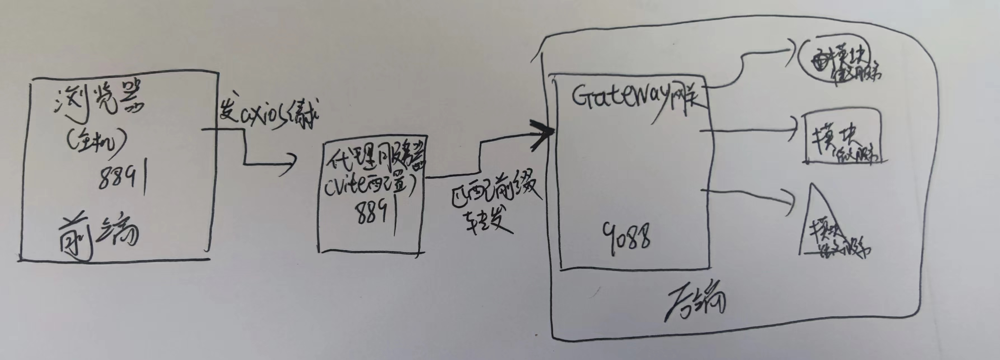

# 后端

## 如何添加新的微服务模块？

再IDea中右键Backend根模块


选择spring Initializer 然后输入name


最后在根目录的pom.xml下添加刚刚创建的module即可


## 项目启动流程

1、首先启动nacos server，注意使用2以上版本的nacos server

启动方法：管理员状态打开cmd，切换到nacos server的bin目录下，输入start.cmd -m standalone，启动nacos

2、然后就可以运行各个微服务模块了，启动对应的springapplication主程序。

3、在 localhost:8848/nacos的服务管理->服务列表 页面可以看到各个运行的微服务。

## Cithub-common

cithub-common模块用于存放每一个微服务都需要的公共依赖/类

## Cithub-gateway

网关服务：

用于路由分发和鉴权。

路由分发：所有前端的请求都先到GateWay网关，Gateway网关再分发到下面各个具体的服务

1、首先创建gateway module

2、然后要使用网关，要写注解`@EnableDiscoveryClient`在网关的main方法上，这样网关就知道其他服务在哪里。

3、要先启动nacos，然后网关才能work（要使用nacos，gateway记得写nacos的配置文件）

4、网关的application.yml文件中写路由的配置

```yaml
spring:
  application:
    name: cithub-gateway
  cloud:
    nacos:
      discovery:
        server-addr: 127.0.0.1:8848

        #网关的路由规则，怎么转发请求的？
    gateway:
      routes:
#        每一个路由的唯一ID
        - id: cithub-guitools
#          转发给哪个微服务？这里转发给cithub-guitools，这个名字是nacos注册中心里的名字（这种写法参考 https://blog.csdn.net/weixin_43852058/article/details/110682367）
          uri: lb://cithub-guitools
#          匹配到什么的时候转发过去？就是匹配规则
          predicates:
            - Path=/api/guitools/**
          filters:
#           重写匹配到的路径，比如上面匹配到了 /api/guitools/listallprojects/...   这个路径
#            那就改写为：/guitools/listallprojects/...
#            -改写规则如下：https://blog.csdn.net/weixin_43199379/article/details/107768203
#			RewritePath= 匹配串, 输出串
            - RewritePath=/api/(?<segment>.*),/$\{segment}
#            - 其中，?<segment>是一个分组，.*表示匹配任意字符0次或多次后将匹配到的字符串放入到该分组中，这里guitools/listallprojects/...放入分组中
#           ，后面的$\{segment}，提取分组中的文本，在此处显示，再拼接前面的/就得到了/guitools/listallprojects/...


#   网关的端口是9088，以后所有的请求都这个端口
#	比如前端请求https://localhost:9088/api/guitools/projects/testGateway
#   经过网关匹配与重写，会变为：https://localhost:9088/guitools/projects/testGateway
server:
  port: 9088

```

GateWay的测试，使用Postman发送请求到http://localhost:9088/api/guitools/projects/testGateway


## Mybatis-plus相关

参考https://baomidou.com/pages/226c21/#%E9%85%8D%E7%BD%AE

1、导入依赖到cithub-common的pom与数据库驱动

```xml
 mybatis-plus依赖：
<dependency>
            <groupId>com.baomidou</groupId>
            <artifactId>mybatis-plus-boot-starter</artifactId>
            <version>3.5.2</version>
        </dependency>

数据库驱动：
 <dependency>
            <groupId>mysql</groupId>
            <artifactId>mysql-connector-java</artifactId>
            <version>8.0.30</version>
        </dependency>
```

2、配置数据源：

在各微服务的application.yml下配置

```yml
spring:
  datasource:
      username: root
      password: 123456
      url: jdbc:mysql://localhost:3306/ct_users
      driver-class-name: com.mysql.cj.jdbc.Driver

```

3、配置mybatis-plus

在各微服务的主程序处写上注解

```java
@MapperScan("com.baomidou.mybatisplus.samples.quickstart.mapper")
```

4、Sql映射文件配置

在各微服务模块的application.yml文件下配置

```yml
mybatis-plus:
  mapper-locations: classpath:/mapper/**/*.xml
```

注意`resources`下的mapper.* 文件夹，存放的是该模块的mybatis-plus配置文件，不要少了！

5、主键自增配置

在各微服务模块的application.yml文件下配置

```yaml
mybatis-plus:
  
  global-config:
    db-config:
      id-type: auto
```


## nacos配置相关

注意到 cithub-common模块的pom.xml里

```xml
<!--注意这里使用的版本是2.2.8，nacos server的版本也要2以上-->
    <dependencyManagement>
        <dependencies>
            <dependency>
                <groupId>com.alibaba.cloud</groupId>
                <artifactId>spring-cloud-alibaba-dependencies</artifactId>
                <version>2.2.8.RELEASE</version>
                <type>pom</type>
                <scope>import</scope>
            </dependency>
        </dependencies>
    </dependencyManagement>
```

各个微服务注册流程：

参考https://github.com/alibaba/spring-cloud-alibaba/blob/2.2.x/spring-cloud-alibaba-examples/nacos-example/nacos-discovery-example/readme.md

1、在Cithub-common的pom.xml里添加`dependencyManagement`依赖。

2、在各个微服务模块的`application.yml`配置文件里写上

nacos server的地址

```yaml
spring:
  cloud:
    nacos:
      discovery:
        server-addr: 127.0.0.1:8848
```

各个微服务模块注册到nacos server的名字，下以cithub-guitools为例

```yaml
spring:
 application:
    name: cithub-guitools
```

3、在各个微服务模块的主程序处添加注解@EnableDiscoveryClient

## Feign远程调用相关

1、引入OpenFeign，谁要使用Feign远程调用，谁就在自己的`Pom.xml`里引入OpenFeign依赖：

比如这里Users想要调guitiools里的接口，那就在users的`pom.xml`里引入OpenFeign依赖

```xml
   <dependency>
            <groupId>org.springframework.cloud</groupId>
            <artifactId>spring-cloud-starter-openfeign</artifactId>
        </dependency>
```

2、编写远程调用接口，这里users想调用guitools，那就在users的`feign`包下编写feign远程调用接口，

这里编写的接口如下

```java
package com.gist.cithub.user.feign;
//注意这里是user的feign包下

import com.gist.cithub.common.utils.R;
import org.springframework.cloud.openfeign.FeignClient;
import org.springframework.web.bind.annotation.RequestMapping;

@FeignClient("cithub-guitools")
public interface guitoolsService {
/*users要远程调用guitools模块的服务
* 1、在该接口上写上注解@FeignClient,告诉springcloud该接口是Feign客户端。（Users调guitools，Users相当于客户端，guitools相当于服务器）
* 2、@FeignClient的value属性写上被调用的模块在注册中心中的名字，这里guitools在注册中心中的名字是cithub-guitools
* 3、cithub-guitools模块有很多接口，要调用哪一个呢？写上完整签名就行，完整签名=注解+函数声明。
*
* 
* */

//完整签名如下：注意@RequestMapping的value属性要写全路径
    @RequestMapping("/guitools/projects/getUserProjects")
    public R getUserProjects();

}

```

以后调用该接口的getUserProjects()方法，会先去注册中心中找"cithub-guitools"所在的位置，然后再去调用"/guitools/projects/getUserProjects"请求对应的方法。

3、谁要使用远程调用，就在主程序上写上注解@EnableFeignClients，这里User要使用远程调用，所以代码如下:

```java
package com.gist.cithub.user;

import org.mybatis.spring.annotation.MapperScan;
import org.springframework.boot.SpringApplication;
import org.springframework.boot.autoconfigure.SpringBootApplication;
import org.springframework.cloud.client.discovery.EnableDiscoveryClient;
import org.springframework.cloud.openfeign.EnableFeignClients;

@SpringBootApplication
@MapperScan("com.gist.cithub.user.dao")
@EnableDiscoveryClient
@EnableFeignClients(basePackages="com.gist.cithub.user.feign")
public class CithubUserApplication {

    public static void main(String[] args) {
        SpringApplication.run(CithubUserApplication.class, args);
    }

}

```

`@EnableFeignClients(basePackages="com.gist.cithub.user.feign")`的`basePackages`属性写的是Feign包名，表名哪个包是Feign包


具体例子:

User的`package com.gist.cithub.user.controller`包下的`public R TestRPC()`方法调用Feign接口`public R getUserProjects()`（在`package com.gist.cithub.user.feign;`下），而Feign接口`public R getUserProjects()`实际远程调用`package com.gist.cithub.guitools.controller`包下`public R getUserProjects() `方法。

> 注意：Feign其实也是Service/dao，它也要注入！即：
>
> ```java
> @Autowired
> private GuitoolsFeignService guitoolsFeignService;
> //在 package com.gist.cithub.user.controller;包里
> ```


## R类

在下面这个包里

```java
package com.gist.cithub.common.utils;
```

其实就是后端封装的结果类，跟前端给后端的数据用Json封装一样的，后端也用R封装一下再给前端。

# 前端

## axios 数组作参数的方法

```javascript
let bibObjArray = [] //bibObjArray是一个数组，里面的元素都是对象
let bibObjArrayJson=JSON.stringify(bibObjArray) //将bibObjArray转为一个json字符串
//然后发给后端
 request({
                    url: '/repo/list/uploadByBib',
                    method: 'POST',
                    data:{
                        bibObjArrayJson
                    }
                }).then(() => { }).catch(() => { }).catch(() => { })
```

```java
//后端接收方法
    @RequestMapping("/uploadByBib")
    public R uploadByBib(@RequestBody Map<String,String> bibObjArrayJson )
    {

        ArrayList<ListEntity> paperList=null;
        //这里传一个String作为参数 给saveUploadFileByBib
        paperList= listService.saveUploadFileByBib(bibObjArrayJson.get("bibObjArrayJson"));
        if(paperList==null)
        {
            return R.ok().put("UploadResult", "Failed!");
        }
        else{
            Boolean flag=listService.saveBatch(paperList);
            if(flag) return R.ok().put("SaveResult", "success!");
            else return R.ok().put("UploadResult", "Failed!");

        }
    }

//saveUploadFileByBib里用Gson解析，解析成Java对象数组
    public ArrayList<ListEntity> saveUploadFileByBib(String JsonString) {
        Gson gson = new Gson();
        JsonParser parser = new JsonParser();
        //先解析成JsonArray
        JsonArray jsonArray = parser.parse(JsonString).getAsJsonArray();
        ArrayList<ListEntity> listEntities = new ArrayList<>();
        //加强for循环遍历JsonArray，将其中每一个json对象转为JAVA对象
        for (JsonElement user : jsonArray) {
            //使用GSON，直接转成Bean对象
            ListEntity listEntity = gson.fromJson(user, ListEntity.class);
            listEntities.add(listEntity);
        }
//        for(ListEntity item : listEntities)
//        {
//            System.out.println("当前item：");
//            System.out.println(item);
//        }
        if(listEntities!=null) return listEntities;
        else return null;


    }

```


# 前端与后端数据交互流程

1、为解决跨域问题，用Vite脚手架配置了代理服务器，代理服务器的协议名、域名、端口号都与浏览器一样，这样代理服务器与浏览器值之间就不会存在跨域问题。

以repo vue项目为例：

它的`vite.config.js`如下：

```js
import { defineConfig } from 'vite'
import vue from '@vitejs/plugin-vue'

// https://vitejs.dev/config/
export default defineConfig({
  plugins: [vue()],
  server:{
    // port配置浏览器（主机）端口号，代理服务器会保持和主机一模一样
    port: 8891,
      //proxy配置代理
    proxy:{
      // 前缀为/api的请求，代理服务器都转发到http://localhost:9088
      '/api':{
        target: 'http://localhost:9088',
        changeOrigin: true,

      }
    }
  }
})

```

通过以上配置，浏览器为：http://127.0.0.1:8891，Vite配置的代理服务器也是http://127.0.0.1:8891，代理服务器匹配到前缀为`/api`的请求时，会自动转发到`target`写的'http://localhost:9088'，而'http://localhost:9088'就是后台网关gateway的地址。

### 以axios发送请求为例：

**axios配置如下**：

```js
import axios from 'axios'
export function request(config) {
  // 1.创建axios的实例
  const instance = axios.create({
    //  baseURL:"http://210.28.135.32:8088/api",
    // baseURL自动拼接到url前面
    // 注意！axios发送请求给的是代理服务器！！由代理服务器（vite脚手架配置）再转发给target,所以这里baseURL的端口号和主机一样
    baseURL: "http://localhost:8891/api",
    // `timeout` 指定请求超时的毫秒数。
    // 如果请求时间超过 `timeout` 的值，则请求会被中断
    // 默认值是 `0` (永不超时)
    // timeout: 5000,

  })
  // 2.1.请求拦截的作用
  instance.interceptors.request.use(config => {
    return config
  }, err => {
    console.log(err);
  })
  // 2.2.响应拦截
  instance.interceptors.response.use(res => {
    return res.data
  }, err => {
    console.log(err);
  })
  // 3.发送真正的网络请求
  return instance(config)
}
```

其中，`baseURL`为http://localhost:8891/api。

注意！axios发送请求给的是代理服务器！！由代理服务器（vite脚手架配置）再转发给target,所以这里baseURL的端口号和主机一样。

`baseURL`:http://localhost:8891/api会自动拼接到`url`前，比如某个发送请求的函数如下：

```js
const testToBackend = () => {
    request({
        url: '/guitools/projects/testGateway',
        method: 'POST',
// .then 请求响应成功时的处理内容
    }).then((res) => {
        projects.projectid=res.projects.projectid
        projects.projectname=res.projects.projectname
        projects.projectdescriptions=res.projects.projectdescriptions
        projects.userid=res.projects.userid
        // .catch 请求响应失败的处理内容
    }).catch((error) => {
        console.log(error)
    })
}
```

那么拼接出来的完整请求路径就是`baseURL`+`url`：http://localhost:8891/api/guitools/projects/testGateway，这个请求发送往代理服务器http://127.0.0.1:8891，因为Vite脚手架的配置，代理服务器发现请求前缀为`/api`，就会将该请求转发给`target`写的'http://localhost:9088'，于是请求变成了http://localhost:9088/api/guitools/projects/testGateway

> gateway网关的路由规则查看cithub-gateway那一节

后台gateway网关接收到http://localhost:9088/api/guitools/projects/testGateway，yml文件中的`predicates`断言匹配到了`/api/guitools/projects/testGateway`,又因为`RewritePath`，重写为了`/guitools/projects/testGateway`,给到cithub-guitools模块，该模块匹配到对应的接口`/guitools/projects/testGateway`进行处理，处理完又返回响应给前端。

- 响应成功，在上面的.then方法里处理，渲染数据
- 响应失败，在上面的.catch方法里处理

总结：

等于说有三个服务器：

1. 浏览器http://127.0.0.1:8891，浏览器=主机
2. 代理服务器（由Vite脚手架配置，为解决跨域问题和浏览器保持一致）http://127.0.0.1:8891
3. 后台网关服务器http://localhost:9088

浏览器发axios请求给代理服务器，代理服务器匹配前缀`/api`，转发给`target`,即后台网关服务器http://localhost:9088，后台网关服务器又转发给对应的模块。

